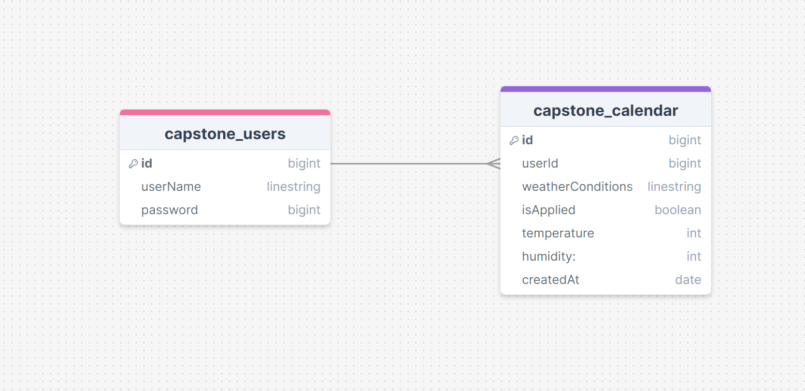

# Project Title

Sunscreen Habit App

## Overview

A user-friendly website dedicated to everyday well-being, designed to help you effortlessly track and enhance your sun care routine. The Web application not only educates you on the importance of sunscreen but also empowers you to maintain healthy skin habits. By simply logging each application of sunscreen with a click, you can monitor your consistency over time. Stay connected with friends and family to observe their dedication to skin health at a glance, while accessing valuable weather insights to gauge the urgency of sun protection on any given day.

Skin health is vital for both self-esteem and cancer prevention, especially for those genetically predisposed to skin cancer. This web app aims to relieve the stress of maintaining sunscreen application habits and transform tracking your skincare journey into a rewarding and enjoyable experience.The goal is to make sunscreen application trivial over weeks months or hopefully years.

### Problem

Protecting oneself from the sun is often underestimated, and tracking habits can be daunting for busy individuals. Many struggle with building new habits, facing common setbacks along the way. It's crucial to recognize that some people may be at high risk of skin cancer without realizing it, underscoring the importance of accessible and effective tools to encourage consistent sun protection habits.

Many habit-building apps struggle to maintain user consistency due to a complex user experience, poor visual design, and negative stigma surrounding the use of third party applications for everyday use. They often compete ineffectively with built-in phone and desktop features, lacking compelling reasons for users to choose them over alternatives.

### User Profile

People who are curious about skin health but are not willing to set aside time to do lots of rigerous reaserch are my main concern with this project, most traffic on the app will be seen in the early morning and occasionally I expect users to log on to see if people in their close circle are also keeping up or to get educated on other health related information on the web app front page.

Some special consierations essential for the functionality of this web application is the general location of the user for giving accurate weather insights and calling time dependent features at the appropriate part of the day.

### Features

List the functionality that your app will include. These can be written as user stories or descriptions with related details. Do not describe _how_ these features are implemented, only _what_ needs to be implemented.

Need to implement a button for the user to press after they have applied sunscreen for the day, the app should notify the user when to expect lots of sunlight and when their skin will be at risk this would be done through using weather API but it will not display any weather statistics the app should feel like a companion and signal to the user in a human friendly kind of way ex: "Expect to see lots of sunlight, use of sunscreen is highly advised", "Expect some sunlight, sunscreen is moderately advised", "Expect to see little to no sunlight today, sunscreen application may be optional today".

The app should store in a database the dates and times of day when the user applied sunscreen. Other uses for a database come from having a login feature and conditional rendering based on what user is logged in, as such password and username information will need to be stored securely.

The user should be able to login using some essential information like name/email, password, place of residence (so I can pull relavent weather data), skintone (further reaserch is required). A user profile system will be necessary to implement peer to peer interaction. A way for users to add contacts who have also signed up will be made so that users can see who is keeping up the habit of applying their sunscreen on time and when the weather calls for it.

A calendar should be implemented which at a glance shows the user a log of their progress from when they made an account till the day they decide to use this feature. The display of information should be simple and all visual hopefully no words will be used as I want the user to know a lot from just one glance. In addition to the log of weather trends in the past the app should show when the user has applied sunscreen in the past. A nice to have would be to show the severity of a missed application, say the user didn't use sunscreen on a really sunny day vs a rainy day visually this difference should be shown to the user.

## Implementation

### Tech Stack

- React
- MySQL
- Express
- Client libraries:
  - react
  - react-router
  - axios
- Server libraries:
  - knex
  - express

### APIs

List any external sources of data that will be used in your app.

OpenWeather API
https://openweathermap.org/

### Sitemap

Login Page
Sing Up Page
Home Page
Data Log Page - Logs weather (cloudy, sunny, raining, etc...) in a calendar like layout
Connections Page - Place for the user to see friends activity
Profile Details Page - (displays weather data and account specific information)

### Mockups

## Login Page

## Sign Up Page

## Home Page

## Data Log Page

## Connections Page

## Profile Details Page

### Data

Describe your data and the relationships between them. You can show this visually using diagrams, or write it out

Weather Api Data: will be used to generate advice prompts on the main page, to conditionally render styling to the Data Log Page to show the user the weather today and in the past Each day will be treated as it's own data object and will be stored in the Database.

Login Page: password and username will be pulled from the input fields and taken to the backend where hopefully hashed and kept safe.

User input on Home Page: the user will need to press a button on home page to indicate that sunscreen has been applied this data will be sent to the Data Log for conditional rendering and then stored in the day object in the database.

### Endpoints

SQL map:

HTTP:
-Get: user Data
{
id: id, (uuid)
userName: userName,
password: password
}

-Get: Get day object
{
id: id, (uuid)
userId: userId,
weatherConditions: weatherConditions, (ex: sunny, cloudy, rainy)
isApplied: false,
temperature: temp, (Celsius)
humidity: humidity (%),
createdAt: Date.now()
}

-Post: user Data
{
id: id,
userName: userName,
password: password
}

-Put: Change isApplied variable to indicate sunscreen being put on for the day
{
id: id, (uuid)
userId: userId,
weatherConditions: weatherConditions, (ex: sunny, cloudy, rainy)
isApplied: req.body.isApplied, (value ressets to false at 12AM user changes this value using a frontend switch that can only be pressed once per day)
temperature: temp, (Celsius)
humidity: humidity (%),
createdAt: Date.now()
}

### Auth

JWT Auth

Login page will be implemented and certain web app features will be locked behind Authentication. This is so the user can still interact with the wbsite even if they don't have an account. The features that are locked will have mockup scenarios and a tutorial for the user to explore. Once logged in the user will have data tied to their account therefore the mockups are no longer valuable to the user.

to indicate a logged out user I can have a mockup user object in database that holds user ID 0.

## Roadmap

Scope your project as a sprint. Break down the tasks that will need to be completed and map out timeframes for implementation. Think about what you can reasonably complete before the due date. The more detail you provide, the easier it will be to build.

Styling and Mockup data:
-Data in Backend: Bring in weather Data from API and bring it to frontend with get post and put methods.

--Mockup Data for non authenticated users: Once I have the weather API pulling in information I need to write out data for at least 10 days in the past to simulate what the user experience would look like for someone who has been active on the app for the past week or more.

--Prompt Data: there are two options, one to do reaserch on the subject of skin health and peace together a dataset on my own or search for an already existing one.

-Frontend routes: Build router for url pathing.

-Styling and functoinality for frontend: Can be completed once I have mockup data ready.

--Functionality Implementing database mock data: Building out the guide features notifying the user that they are viewing a preview of the web app because they haven't signed up yet and allowing the user to still interact with the locked featues so they get a better picture on what the app is like before they decide to sign up.

## Nice-to-haves

Being able to see other people's Data Logs and daily status is something I plan to implement after the capstone presentation however it may be possible to implement on time.
